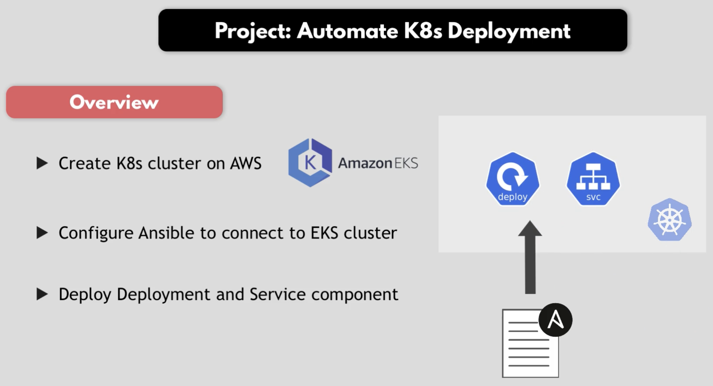
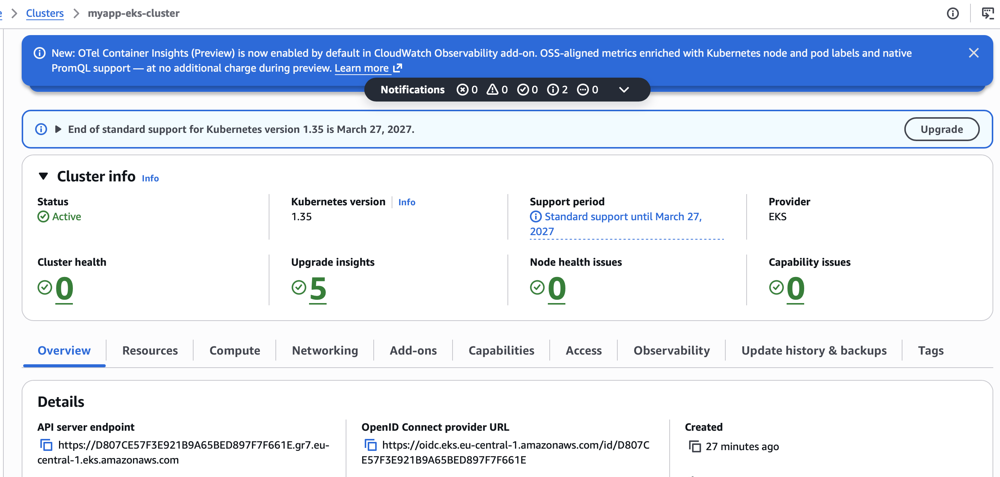
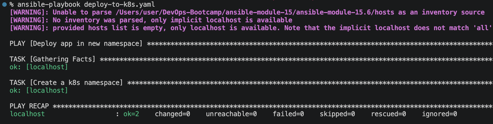
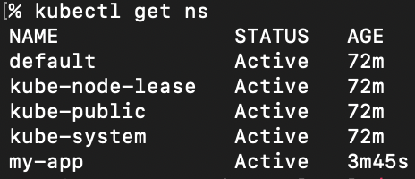
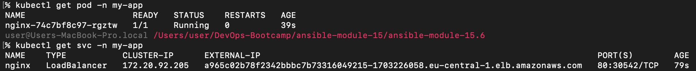
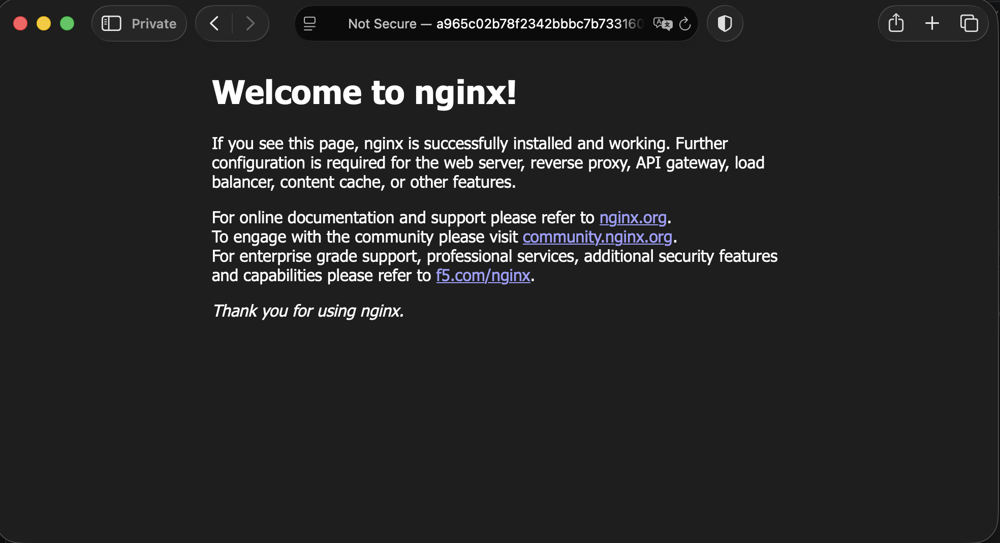
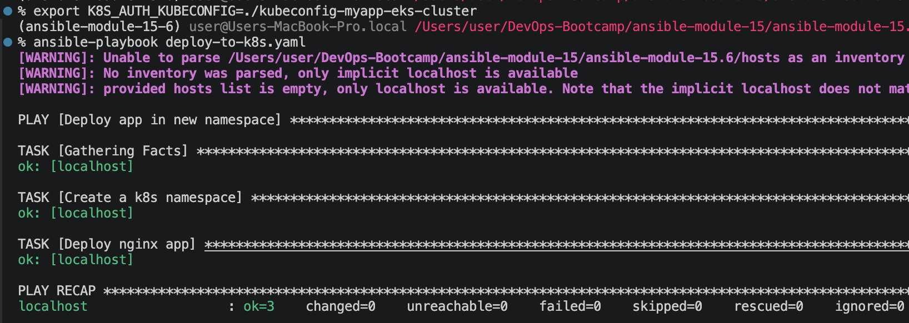

# Module 15 - Configuration Management with Ansible

This repository contains a demo project created as part of my **DevOps studies** in the [TechWorld with Nana – DevOps Bootcamp](https://www.techworld-with-nana.com/devops-bootcamp).

**Demo Project:** Automate Kubernetes Deployment

**Technologies used:** Ansible, Terraform, Kubernetes, AWS EKS, Python, Linux

**Project Description:**

- Create EKS cluster with Terraform
- Write Ansible Play to deploy application in a new K8s namespace

---

## Overview



## Prerequisites

Copy and fill in the variables file:

```sh
cp terraform.tfvars.example terraform.tfvars
```

### Create EKS cluster with Terraform

Provision the infrastructure:

```sh
terraform init
terraform apply
```





### Create a Namespace in EKS cluster

Generate a kubeconfig for the new cluster. The `--region` and `--name` must match `terraform.tfvars` and the cluster `name` in `eks-cluster.tf`:

```sh
aws eks update-kubeconfig --region eu-central-1 --name myapp-eks-cluster --kubeconfig ./kubeconfig-myapp-eks-cluster
```

Create `deploy-to-k8s.yaml` file

```yaml
---
- name: Deploy app in new namespace
  hosts: localhost
  tasks:
    - name: Create a k8s namespace
      kubernetes.core.k8s:
        name: my-app
        api_version: v1
        kind: Namespace
        state: present
        kubeconfig: ./kubeconfig-myapp-eks-cluster
```

Doc: https://docs.ansible.com/projects/ansible/latest/collections/kubernetes/core/k8s_module.html

The `kubernetes.core.k8s` module needs the Kubernetes Python client (plus PyYAML and jsonpatch) available to the interpreter Ansible runs with. Install them into the project environment:

```sh
uv sync
```

Verify the libraries import correctly (`uv run` uses the project virtualenv):

```sh
uv run python3 -c "import yaml, kubernetes, jsonpatch; print('dependencies OK')"
```

> Note: PyYAML is imported as `yaml`, not `pyyaml`.

The module itself ships in the `kubernetes.core` Ansible collection. It is bundled with the `ansible` community package; if you installed `ansible-core` only, add it with:

```sh
ansible-galaxy collection install kubernetes.core
```

Create `ansible.cfg`

```conf
[defaults]
host_key_checking = False
inventory = hosts
enable_plugins = aws_ec2
remote_user = ec2-user
private_key_file = ~/.ssh/id_rsa
```

Execute the playbook

```sh
ansible-playbook deploy-to-k8s.yaml
```



Connect to k8s cluster

```sh
export KUBECONFIG=./kubeconfig-myapp-eks-cluster
kubectl get ns
```



### Deploy app in new namespace


Add deploy app step to `deploy-to-k8s.yaml`:
```yaml
    - name: Deploy nginx app
      kubernetes.core.k8s:
        src: ./nginx.yaml
        state: present
        kubeconfig: ./kubeconfig-myapp-eks-cluster
        namespace: my-app
```

Execute the playbook

```sh
ansible-playbook deploy-to-k8s.yaml
```

Check the app. The `nginx` Service is of type `LoadBalancer`, so AWS provisions an external load balancer — wait until `EXTERNAL-IP` shows a hostname rather than `<pending>`:

```sh
kubectl get pod -n my-app
kubectl get svc -n my-app
```



Copy `EXTERNAL-IP` and open it in the browser:



### Set environment variable for kubeconfig

Instead of passing `kubeconfig:` to every task, the `kubernetes.core` collection automatically reads the `K8S_AUTH_KUBECONFIG` environment variable:

```sh
export K8S_AUTH_KUBECONFIG=./kubeconfig-myapp-eks-cluster
```

Remove the `kubeconfig:` lines from every task in `deploy-to-k8s.yaml`, then run the playbook again:

```sh
ansible-playbook deploy-to-k8s.yaml
```



### Clean-up

The `nginx` Service of type `LoadBalancer` provisions an AWS load balancer that is **not** tracked in Terraform state. Delete the Kubernetes resources first so the load balancer is released; otherwise it can orphan ENIs and block the VPC from being destroyed:

```sh
kubectl delete -f nginx.yaml -n my-app
```

Then destroy the cluster and all remaining infrastructure:

```sh
terraform destroy
```
